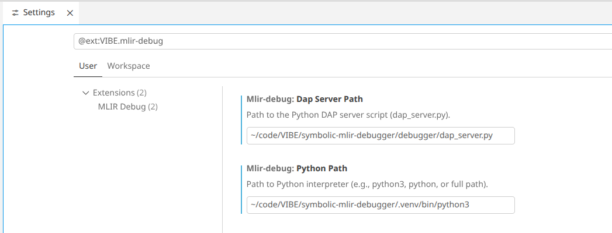

# Symbolic MLIR Debugger

<div align="center">
  
</div>

A symbolic and concolic execution engine for MLIR (Multi-Level Intermediate Representation) programs with full Debug Adapter Protocol (DAP) support for Visual Studio Code integration.

## Overview

The Symbolic MLIR Debugger enables advanced debugging and analysis of MLIR programs through symbolic execution. It transforms MLIR operations into SMT constraints using the Z3 solver, allowing for path exploration, constraint solving, and automated test generation.

### Key Features

- **Symbolic & Concolic Execution**: Execute MLIR programs with symbolic inputs, exploring multiple execution paths simultaneously
- **SMT Integration**: Leverages Z3 theorem prover for constraint solving and path feasibility analysis
- **VS Code Integration**: Full DAP implementation with debugging UI, breakpoints, variable inspection, and step-through execution
- **Modular Architecture**: Extensible dialect support, memory models, and hardware descriptions
- **Path Exploration**: Automatically discovers and analyzes all feasible execution paths
- **Test Generation**: Generates concrete test cases covering different execution paths

## Architecture

```
┌─────────────────────────────────────────────────────────────┐
│                    VS Code Extension                        │
│                  (Debug Adapter Protocol)                   │
└────────────────────────────┬────────────────────────────────┘
                             │
┌────────────────────────────▼────────────────────────────────┐
│                 Symbolic MLIR Debugger                       │
├──────────────────────────────────────────────────────────────┤
│  • Parser (MLIR text → AST)                                 │
│  • Symbolic Interpreter (MLIR → Z3 constraints)             │
│  • Concolic Engine (Mixed concrete/symbolic execution)      │
│  • Dialect Registry (Extensible operation handlers)         │
│  • State Manager (Path forking & merging)                   │
└──────────────────────────────────────────────────────────────┘
                             │
┌────────────────────────────▼────────────────────────────────┐
│                     Z3 SMT Solver                           │
│               (Constraint solving & SAT)                    │
└──────────────────────────────────────────────────────────────┘
```

## Applications

### Execution Path Exploration
Discover all feasible execution paths through MLIR programs, identifying:
- Unreachable code segments
- Boundary conditions
- Path constraints and dependencies

### Automated Test Generation
Generate comprehensive test suites by:
- Solving path constraints to produce concrete inputs
- Covering different execution paths
- Creating regression tests for MLIR transformations

### Bug Detection & Verification
- Detect potential division-by-zero errors
- Identify array bounds violations
- Verify loop invariants and postconditions

### MLIR Dialect Development
- Test new MLIR dialects and operations
- Validate dialect lowering transformations
- Debug complex MLIR compilation pipelines

## Getting Started

### Prerequisites
- Python 3.8+
- Z3 solver (`pip install z3-solver`)
- VS Code (for debugging interface)

### Installation

```bash
# Clone the repository
git clone https://github.com/yourusername/symbolic-mlir-debugger.git
cd symbolic-mlir-debugger

# Install Python dependencies
cd debugger
pip install -r requirements.txt

# Install VS Code extension dependencies
cd ../vscode
npm install

# Note: See "Building and Installing the VS Code Extension" section below for build instructions
```

### Running Tests

```bash
cd debugger
python -m pytest                         # Run all tests
python -m pytest tests/test_parser.py    # Run parser tests
python -m pytest -m interpreter          # Run interpreter tests
```

### Building and Installing the VS Code Extension

The VS Code extension provides a complete debugging interface for MLIR programs. Follow these steps to build and install it:

#### Building the Extension

```bash
cd vscode

# Install dependencies
npm install

# Build the extension (compiles TypeScript to JavaScript)
npm run build

# Package the extension into a .vsix file
npm run package  # or: vsce package --no-yarn
```

This generates a `.vsix` file (e.g., `mlir-debug-0.1.0.vsix`) that can be installed in VS Code.

#### Installing the Extension

**Option 1: Install from VSIX file**
1. In VS Code, go to Extensions (Ctrl+Shift+X)
2. Click the "..." menu and select "Install from VSIX..."
3. Navigate to the generated `.vsix` file and install it

**Option 2: Install for development**
```bash
# From the vscode/ directory
npm run watch  # Starts TypeScript compilation in watch mode
```

Then in VSCode:
1. First install the [official MLIR extension](https://marketplace.visualstudio.com/items?itemName=llvm-vs-code-extensions.vscode-mlir) for MLIR filetype and language server support.
2. Configure MLIR debugger extension and specify DAP server location.


### Using the VS Code Extension

1. Open an MLIR file (`.mlir` extension) in VS Code
2. Set breakpoints by clicking in the gutter next to line numbers
3. Start debugging with F5 or click the debug icon in the activity bar
4. Use the debug toolbar to:
   - Step through execution (F10)
   - Step into functions (F11)
   - Continue execution (F5)
   - Restart debugging (Ctrl+Shift+F5)
5. Inspect variables in the debug sidebar
6. View the call stack and navigate between stack frames

## Extending the Debugger

### Adding New Dialects
1. Create dialect file in `debugger/parser/dialects/`
2. Define operation classes inheriting from `DialectOp`
3. Implement symbolic execution handlers in `debugger/interpreter/dialects/`
4. Register the dialect in the appropriate `__init__.py` files

### Custom Memory Models
Override memory operations in `debugger/interpreter/memory.py` to implement:
- Different pointer semantics
- Custom allocation strategies
- Hardware-specific memory hierarchies

### Hardware-Specific Extensions
Implement backend-specific operations for:
- GPU/accelerator memory operations
- Vector/SIMD instructions
- Custom arithmetic types

## License

This project is licensed under the MIT License - see the [LICENSE](LICENSE) file for details.

**Third-Party Components:**
- pymlir parser (BSD 3-Clause License) - see [LICENSE-PYMLIR.txt](LICENSE-PYMLIR.txt)
- VS Code Debug Adapter Template (MIT License) - see [vscode/LICENSE.txt](vscode/LICENSE.txt)

Full attribution details in [NOTICE.txt](NOTICE.txt).

## Acknowledgments

- Based on pymlir from ETH Zurich's Scalable Parallel Computing Lab
- Uses VS Code Debug Adapter Protocol template
- Built with Z3 theorem prover from Microsoft Research
- MLIR community for the intermediate representation framework

## Contributing

Contributions are welcome! Please see the [AGENTS.md](AGENTS.md) file for development guidelines and code style conventions.